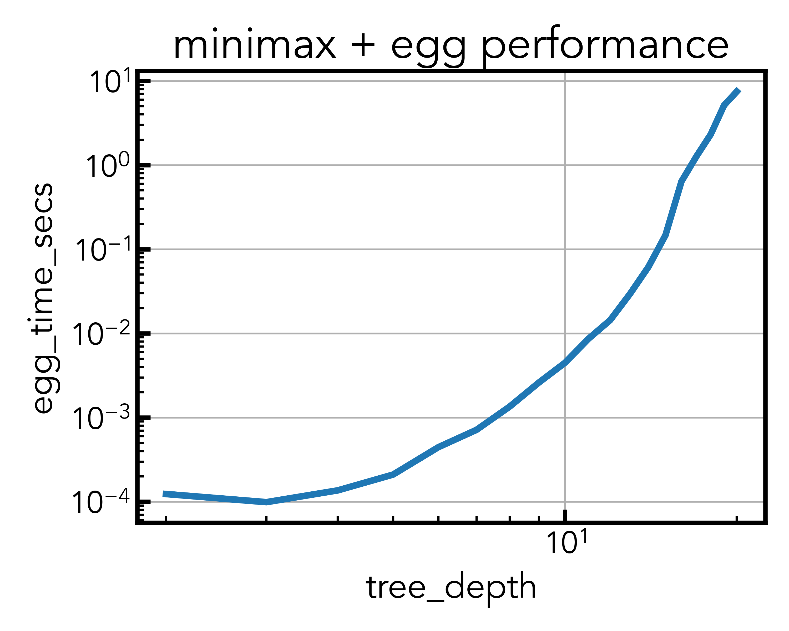

# minimax-egg

### A Rust package utilizing egg ([e-graphs good](https://github.com/egraphs-good/egg)) for the [Minimax](https://en.wikipedia.org/wiki/Minimax) combinatorial search algorithm 

### Basic usage

`minimax-egg` is a Rust package that uses [`rust-argparse`](https://github.com/tailhook/rust-argparse) functionality. 

Therefore, you must `build` the package before executing it, e.g.,  

```
cargo build --release 
./target/release/minimax-egg
```

There are a handful of command-line arguments. For example, if you wish to apply the algorithm to a tree with a depth of 4 and visualize the e-graph both before and after performing rewrites, you would run

```
./target/release/minimax-egg -d 4 --visualize
```

and e-graph visualizations would be saved to `target/old_egraph.png` and `target/new_egraph.png`. 

All command-line arguments may be viewed with the `-h` flag, e.g., 
```
./target/release/minimax-egg -h
```

### Performance testing

In order to test the performance of `minimax-egg`, simply run
```
./run.sh
```
which will apply the Rust package to trees with depths of 2 to 20. Performance will be saved to the `target/performance.csv` by default, and additionally, it will be plotted and saved as a matplotlib figure in the `figures` directory (e.g., `figures/egg_time_secs.png`). 



NOTE: If you wish to increase the largest depth tested, you may have to adjust the settings of the Runner in [src/utils.rs](https://github.com/reecehuff/minimax-egg/blob/9b6acc11481557bed10ca97ed3b3c98c27a2bc61/src/utils.rs#L104).

### Future work
- [ ] Each branch in the tree is split into two. Future iterations could generalize the `Applier` (see [`src/utils.rs`](src/utils.rs)) to operate on [`List`](https://docs.rs/egg/latest/egg/macro.define_language.html)'s. This would also change the construction of the tree in `generate_tree()` (see [`src/tree.rs`](src/tree.rs)).
- [ ] The `Applier` simply merges the e-node with the max or min SimpleLanguage::Num() to its parent. 
- [ ] The performance evaluation is currently a basic timer around computationally expensive functions. A better approach could use [Tests](https://doc.rust-lang.org/cargo/guide/tests.html) among other things. 